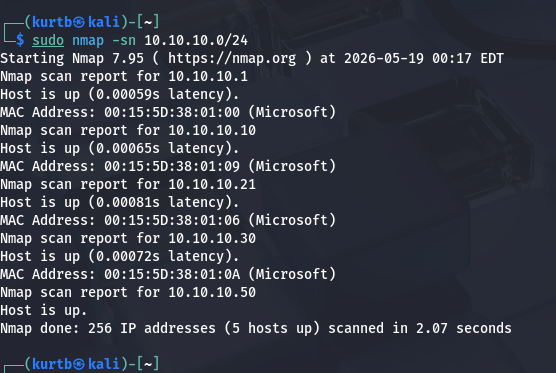
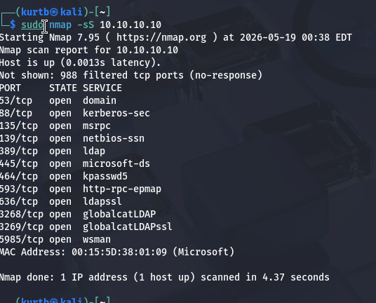
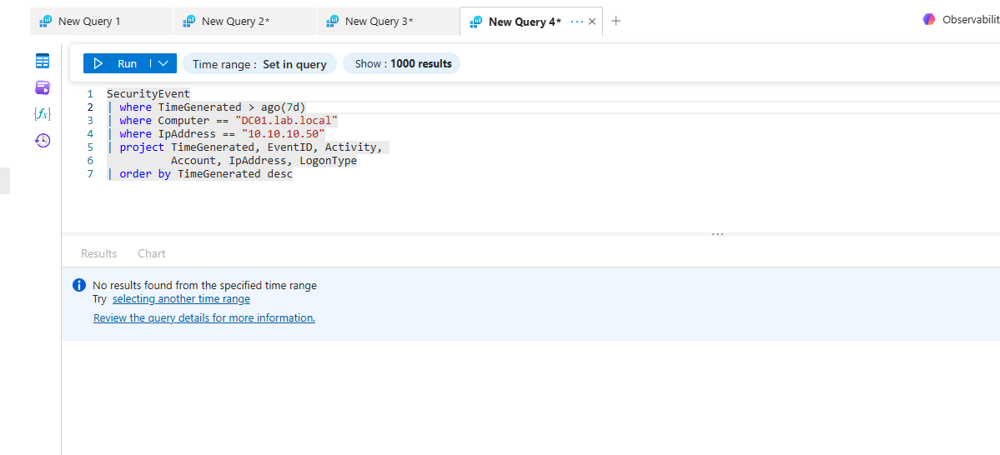

# Network Reconnaissance Detection Gap Analysis
**MITRE ATT&CK:** T1046 - Network Service Discovery | 
T1595 - Active Scanning  
**Environment:** Kali Linux → Windows Server 2022 (DC01)  
**Detection Stack:** Sysmon + AMA + Azure Sentinel  

## Overview
This detection engineering exercise documents a critical 
blind spot in endpoint-based detection pipelines: network 
reconnaissance activity generates zero Windows Security 
Log events, leaving defenders completely blind during 
the earliest stages of an attack.

## Attack Simulated
Full Nmap recon sequence executed from Kali Linux 
against a Windows Server 2022 domain controller:

- Host discovery (ping sweep)
- SYN scan — top 1000 ports
- Service and version detection
- OS fingerprinting
- Aggressive scan with NSE scripts

## What The Attacker Learns
A single Nmap aggressive scan against a domain controller 
reveals without any credentials:

- Hostname and fully qualified domain name
- Operating system and version
- All exposed services and versions
- Domain name and AD site information
- SMB signing status
- WinRM availability — remote execution surface
- Kerberos presence — confirms AD environment

## Detection Results
Query against SecurityEvent for source IP during 
active scanning window returned zero results.

SYN scans never complete the TCP handshake. Windows 
Security Logs only record completed authentication 
events — not raw network probes. An attacker can 
fully map your network without generating a single 
Windows Security Log entry.

## Detection Coverage Map
| Attack Stage | Detection Status | Reason |
|-------------|-----------------|--------|
| Network scanning | ❌ Blind | No network telemetry |
| Port enumeration | ❌ Blind | No completed handshake |
| Service fingerprint | ❌ Blind | No authentication attempt |
| Authentication abuse | ✅ Visible | 4624/4625 events |
| Process execution | ✅ Visible | 4688/Sysmon ID 1 |

## Remediation
Deploy Sysmon with network connection logging (Event ID 3)
for endpoint-level connection visibility. For full 
network-layer coverage, deploy Zeek or Suricata as 
a network flow collector.

## So What
Attackers spend days in reconnaissance before touching 
a single credential. Without network telemetry, your 
detection pipeline is blind to everything they learn 
about your environment during this phase. This finding 
establishes the baseline detection gap that all 
subsequent detection rules are built to close.

## Environment

## Evidence

**Network Reconnaissance — Kali Ping Sweep**

**DC01 Attack Surface — Nmap SYN Scan**

**Sentinel Detection Gap — Zero Results**

- Attack machine: Kali Linux 2026.x
- Target: Windows Server 2022 Domain Controller
- Pipeline: AMA → Azure Arc → DCR → Log Analytics → Sentinel
- Lab: Isolated HyperV environment
